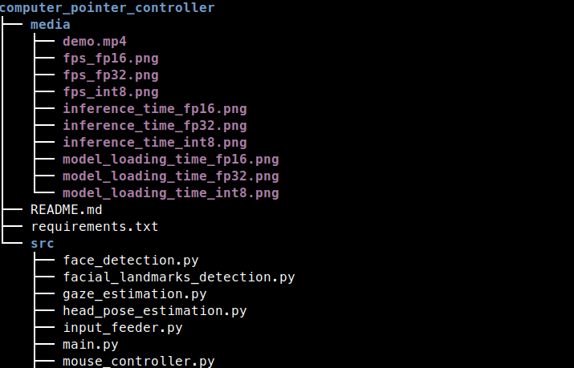
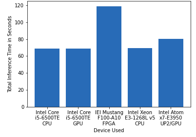
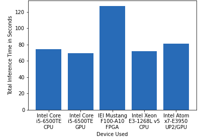
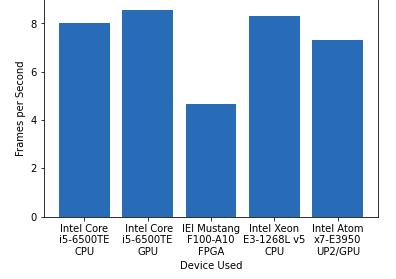
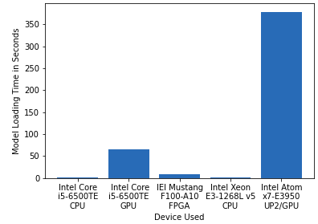
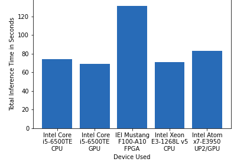
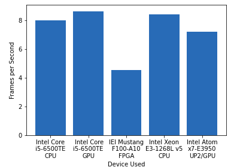
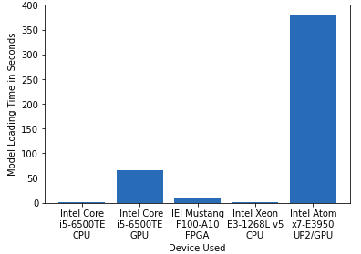

# Computer-Pointer-Controller

## Introduction
Computer Pointer Controller app is used to controll the movement of mouse pointer by the direction of eyes and also estimated pose of head. This app takes video as input and then app estimates eye-direction and head-pose and based on that estimation it move the mouse pointers.

## Demo video
[](https://www.youtube.com/watch?v=qR9rQQ4wiMQ)

## Project Set Up and Installation

### Setup

#### Prerequisites
  - You need to install openvino successfully. <br/>
  See this [guide](https://docs.openvinotoolkit.org/latest/_docs_install_guides_installing_openvino_linux.html) for installing openvino.

#### Step 1
Clone the repository:- https://github.com/denilDG/Computer-Pointer-Controller

#### Step 2
Initialize the openVINO environment:-
```
source /opt/intel/openvino/bin/setupvars.sh -pyver 3.5
```

#### Step 3

Download the following models by using openVINO model downloader:-

**1. Face Detection Model**
```
python /opt/intel/openvino/deployment_tools/tools/model_downloader/downloader.py --name "face-detection-adas-binary-0001"
```
**2. Facial Landmarks Detection Model**
```
python /opt/intel/openvino/deployment_tools/tools/model_downloader/downloader.py --name "landmarks-regression-retail-0009"
```
**3. Head Pose Estimation Model**
```
python /opt/intel/openvino/deployment_tools/tools/model_downloader/downloader.py --name "head-pose-estimation-adas-0001"
```
**4. Gaze Estimation Model**
```
python /opt/intel/openvino/deployment_tools/tools/model_downloader/downloader.py --name "gaze-estimation-adas-0002"
```

## Demo

Open a new terminal and run the following commands:-

**1. Change the directory to src directory of project repository**
```
cd <project-repo-path>/src
```
**2. Run the main.py file**
```
python main.py -f <Path of xml file of face detection model> \
-fl <Path of xml file of facial landmarks detection model> \
-hp <Path of xml file of head pose estimation model> \
-g <Path of xml file of gaze estimation model> \
-i <Path of input video file or enter cam for taking input video from webcam> 
```

- If you want to run app on GPU:-
```
python main.py -f <Path of xml file of face detection model> \
-fl <Path of xml file of facial landmarks detection model> \
-hp <Path of xml file of head pose estimation model> \
-g <Path of xml file of gaze estimation model> \
-i <Path of input video file or enter cam for taking input video from webcam> 
-d GPU
```
- If you want to run app on FPGA:-
```
python main.py -f <Path of xml file of face detection model> \
-fl <Path of xml file of facial landmarks detection model> \
-hp <Path of xml file of head pose estimation model> \
-g <Path of xml file of gaze estimation model> \
-i <Path of input video file or enter cam for taking input video from webcam> 
-d HETERO:FPGA,CPU
```

## Documentation

### Documentatiob of used models

1. [Face Detection Model](https://docs.openvinotoolkit.org/latest/_models_intel_face_detection_adas_binary_0001_description_face_detection_adas_binary_0001.html)
2. [Facial Landmarks Detection Model](https://docs.openvinotoolkit.org/latest/_models_intel_landmarks_regression_retail_0009_description_landmarks_regression_retail_0009.html)
3. [Head Pose Estimation Model](https://docs.openvinotoolkit.org/latest/_models_intel_head_pose_estimation_adas_0001_description_head_pose_estimation_adas_0001.html)
4. [Gaze Estimation Model](https://docs.openvinotoolkit.org/latest/_models_intel_gaze_estimation_adas_0002_description_gaze_estimation_adas_0002.html)

### Command Line Arguments for Running the app

Following are commanda line arguments that can use for while running the main.py file ` python main.py `:-

  1. -h                : Get the information about all the command line arguments
  2. -fl    (required) : Specify the path of Face Detection model's xml file
  3. -hp    (required) : Specify the path of Head Pose Estimation model's xml file
  4. -g     (required) : Specify the path of Gaze Estimation model's xml file
  5. -i     (required) : Specify the path of input video file or enter cam for taking input video from webcam
  6. -d     (optional) : Specify the target device to infer the video file on the model. Suppoerted devices are: CPU, GPU,                            FPGA (For running on FPGA used HETERO:FPGA,CPU), MYRIAD.
  7. -l     (optional) : Specify the absolute path of cpu extension if some layers of models are not supported on the device.
  9. -prob  (optional) : Specify the probability threshold for face detection model to detect the face accurately from video frame.
  8. -flags (optional) : Specify the flags from fd, fld, hp, ge if you want to visualize the output of corresponding models                           of each frame (write flags with space seperation. Ex:- -flags fd fld hp).

### Directory Structure of the project



- src folder contains all the source files:-
  1. face_detection.py 
     - Contains preprocession of video frame, perform infernce on it and detect the face, postprocess the                          outputs.
     
  2. facial_landmarks_detection.py
     - Take the deteted face as input, preprocessed it, perform inference on it and detect the eye landmarks, postprocess          the outputs.
     
  3. head_pose_estimation.py
     - Take the detected face as input, preprocessed it, perform inference on it and detect the head postion by predicting          yaw - roll - pitch angles, postprocess the outputs.
     
  4. gaze_estimation.py
     - Take the left eye, rigt eye, head pose angles as inputs, preprocessed it, perform inference and predict the gaze            vector, postprocess the outputs.
     
  5. input_feeder.py
     - Contains InputFeeder class which initialize VideoCapture as per the user argument and return the frames one by one.
     
  6. mouse_controller.py
     - Contains MouseController class which take x, y coordinates value, speed, precisions and according these values it            moves the mouse pointer by using pyautogui library.
  7. main.py
     - Users need to run main.py file for running the app.
 
- media folder contains demo video which user can use for testing the app.


## Benchmarks
Benchmark results of the model.

### FP32

**Inference Time** <br/> 


**Frames per Second** <br/> 


**Model Loading Time** <br/> 


### FP16

**Inference Time** <br/> 


**Frames per Second** <br/> 


**Model Loading Time** <br/> 


### INT8
**Inference Time** <br/> 


**Frames per Second** <br/> 


**Model Loading Time** <br/> 


## Results
I have run the model in 5 diffrent hardware:-
1. Intel Core i5-6500TE CPU 
2. Intel Core i5-6500TE GPU 
3. IEI Mustang F100-A10 FPGA 
4. Intel Xeon E3-1268L v5 CPU 
5. Intel Atom x7-E3950 UP2 GPU

Also compared their performances by inference time, frame per second and model loading time.

As we can see from above graph that FPGA took more time for inference than other device because it programs each gate of fpga for compatible for this application. It can take time but there are advantages of FPGA such as:-
- It is robust meaning it is programmable per requirements unlike other hardwares.
- It has also longer life-span.

GPU proccesed more frames per second compared to any other hardware and specially when model precision is FP16 because GPU has severals Execution units and their instruction sets are optimized for 16bit floating point data types.

- We have run models with different precision, but precision affects the accuracy. Mdoel size can reduce by lowing the precision from FP32 to FP16 or INT8 and inference becomes faster but because of lowing the precision model can lose some of the important information because of that accuracy of model can decrease. 

- So when you use lower precision model then you can get lower accuracy than higher precision model.

## Stand Out Suggestions

### Edge Cases

1. If for some reason model can not detect the face then it prints unable to detect the face and read another frame till it    detects the face or user closes the window.

2. If there are more than one face detected in the frame then model takes the first detected face for control the mouse  pointer.


